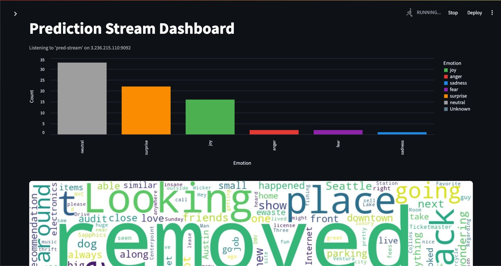
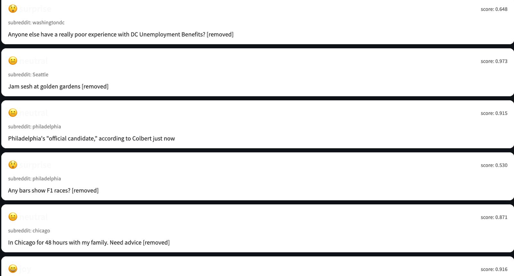
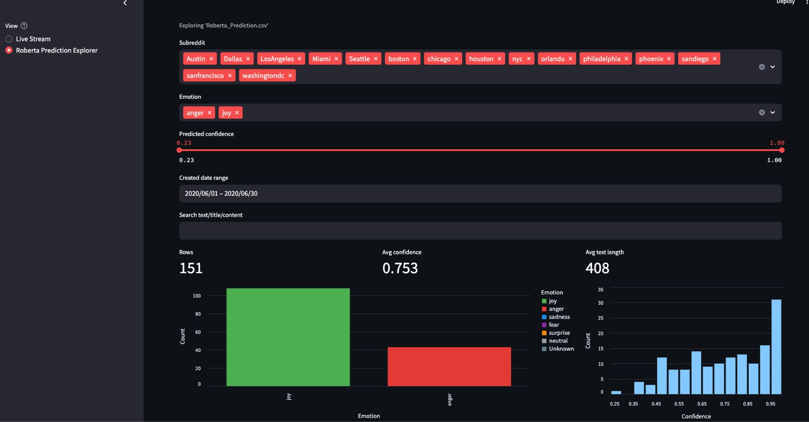
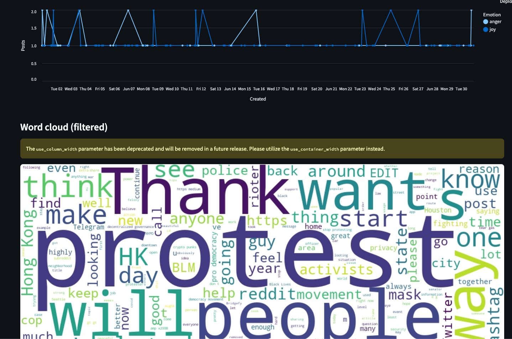
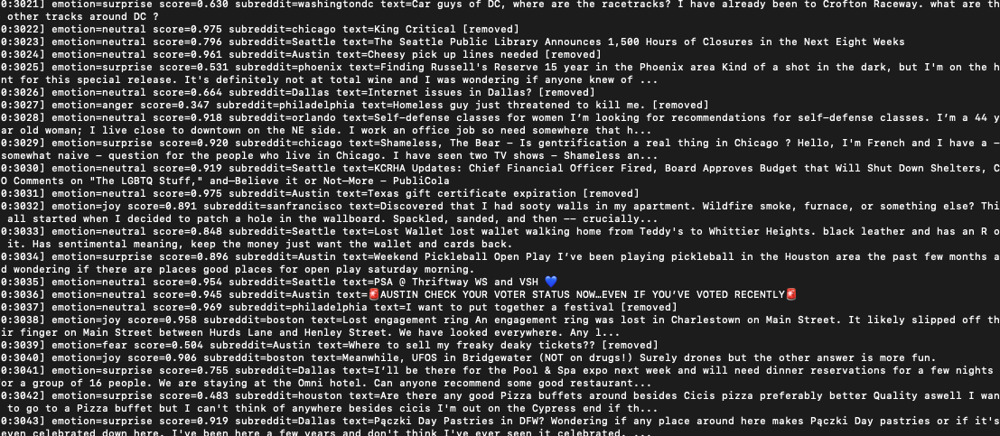
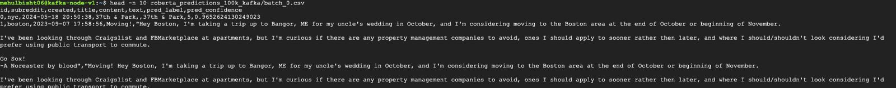

# Reddit City Emotion Pipeline

End-to-end pipeline that ingests Reddit submissions, cleans them with Spark, classifies emotions with a fine-tuned RoBERTa/GoEmotions model, and surfaces both historical and live trends by city. Runs across AWS and GCP (S3 + Spark + EC2/Kafka + EC2 inference) and streams to a streamlit dashboard.
Demo video (dashboard walk-through): .gif)

## Repo Layout 
```
term-paper/
  code/
    spark/data_cleaning_spark.py         # Spark ETL from NDJSON/zst -> cleaned CSV
    batch/historical_predictions.py      # Batch inference for historical posts
    streaming/producer.py                # Sends cleaned rows to Kafka (demo-stream)
    streaming/consumer.py                # ML service: consumes, predicts, publishes to pred-stream
    dashboard/pred_stream_consumer.py    # Streamlit dashboard for live + historical views
    notebooks/FINAL_BERT.ipynb           # Model experimentation
    notebooks/FINAL_ROBERTA.ipynb
  data/
    city_submissions/                    # Raw NDJSON per city (sample drop)
    sample/clean.csv                     # Cleaned sample
    sample/Roberta_Prediction.csv        # Sample batch predictions
.env (set Kafka/model paths)
requirements.txt
```

## Data
- `term-project/data/city_submissions`: raw NDJSON exports per city sourced from the Pushshift top-40k subreddit dump ([link](https://www.reddit.com/r/pushshift/comments/1itme1k/separate_dump_files_for_the_top_40k_subreddits/)). Cities included: Austin, Boston, Chicago, Dallas, Houston, Los Angeles, Miami, NYC, Orlando, Philadelphia, Phoenix, San Diego, San Francisco, Seattle, Washington DC. The raw pull was ~45 GB of NDJSON before Spark cleaning/filtering it down to 5M+ rows.
- `term-project/data/sample/clean.csv`: cleaned subset with `subreddit, created, title, content, text`.
- `term-project/data/sample/Roberta_Prediction.csv`: cleaned subset + `pred_label (0-5), pred_emotion, pred_confidence`.

## Environment & Install
Python 3.10+ recommended.
```
pip install -r requirements.txt
```
.env template (override defaults as needed):
```
KAFKA_BOOTSTRAP=3.236.215.110:9092
KAFKA_TOPIC=demo-stream
KAFKA_PRED_TOPIC=pred-stream
KAFKA_GROUP_ID=emotion-consumer
KAFKA_PRED_GROUP_ID=pred-stream-reader
MODEL_DIR=/path/to/roberta-goemotions-6class-final
PRODUCER_CSV=/absolute/path/to/clean.csv        # optional; defaults to term-paper/data/sample/clean.csv
PREDICTION_CSV_PATH=/absolute/path/to/Roberta_Prediction.csv
HIST_INPUT_CSV=...
HIST_OUTPUT_CSV=...
```

## Historical Pipeline
1) **Clean NDJSON with Spark + S3**  
`term-paper/code/spark/data_cleaning_spark.py` downloads zstd archives from S3 (`bigdatafinalprojectcs777/data/historical_data/compressed/`), cleans, and writes CSV back to S3 under `data/historical_data/clean/`.
Run (Spark cluster/EMR or local spark-submit):
```
spark-submit term-paper/code/spark/data_cleaning_spark.py
```
Key cleaning steps:
```python
df_clean = df.withColumn("created", from_unixtime(col("created_utc")).cast("timestamp")) \
             .withColumnRenamed("selftext", "content") \
             .withColumn("content", coalesce(col("content"), lit(""))) \
             .withColumn("title", coalesce(col("title"), lit("")))
df_clean = df_clean.withColumn("content", regexp_replace(col("content"), r'http\S+|www\S+', ' '))
df_clean = df_clean.withColumn("content", lower(col("content")))
df_clean = df_clean.withColumn("content", regexp_replace(col("content"), r'[^a-z\s]', ' '))
df_clean = df_clean.withColumn("content_tokens", split(col("content"), " "))
df_clean = StopWordsRemover(inputCol="content_tokens", outputCol="content_filtered").transform(df_clean)
df_clean = df_clean.withColumn("text", concat_ws(" ", col("title"), col("content_final")))
```

2) **Batch emotion inference on historical CSVs**  
Uses the same RoBERTa variant as streaming to keep label parity.
```
python term-paper/code/batch/historical_predictions.py \
  --input term-paper/data/sample/clean.csv \
  --output term-paper/data/sample/Roberta_Prediction.csv \
  --model-dir /path/to/roberta-goemotions-6class-final \
  --batch-size 16
```
Adds `pred_label`, `pred_emotion`, and `pred_confidence` columns for downstream dashboards/BigQuery.

## Streaming Pipeline (Kafka)
Topics: `demo-stream` (raw/clean posts) and `pred-stream` (enriched predictions).

1) **Producer (simulated live feed)**
```
python term-paper/code/streaming/producer.py
```
Reads `clean.csv`, shuffles rows, and streams JSON payloads to `demo-stream`.

2) **ML service consumer (classification + publish)**
```
python term-paper/code/streaming/consumer.py
```
Consumes `demo-stream`, predicts emotion, and publishes to `pred-stream`. Core inference:
```python
def predict_emotion_6(text: str):
    inputs = tokenizer(text, return_tensors="pt", truncation=True, max_length=128).to(device)
    with torch.no_grad():
        outputs = model(**inputs)
        probs = torch.softmax(outputs.logits, dim=-1)[0]
        pred_id = int(torch.argmax(probs).item())
    return id2six_label[pred_id], float(probs[pred_id].item())
```

3) **Dashboard / stream consumer**
```
streamlit run term-paper/code/dashboard/pred_stream_consumer.py
```
- Live mode: consumes `pred-stream`, shows emotion bars, wordcloud, and message cards.  
- Explorer mode: uses `Roberta_Prediction.csv` with filters for subreddit, emotion, confidence, date, and text search.

Dashboard (live stream):




Dashboard (historical explorer):



## Cloud Setup Notes
- **S3 storage**: Drop compressed NDJSON to `s3://bigdatafinalprojectcs777/data/historical_data/compressed/`; cleaned CSVs land in `.../clean/` and aggregated 2024 data in `.../clean/data24.csv`.
- **Kafka on EC2 (t3.small ok)**:
  - Install Java 11, Kafka, Python, Zookeeper.
  - Update `server.properties` + `zookeeper.properties` with the EC2 private IP; optionally bind to Elastic IP for stability.
  - Open security group inbound for Kafka brokers (9092) + Zookeeper (2181) from producers/consumers; allow outbound to ML service.
  - Create topics: `bin/kafka-topics.sh --create --topic demo-stream --replication-factor 1 --partitions 3 --bootstrap-server <broker>` and same for `pred-stream`.
  - Configure ACLs to permit producer/consumer clients hitting those topics from your VPC or trusted IPs.
- **ML service on EC2 (m4.large or bigger)**:
  - Install Python, `pip install -r requirements.txt`, and `torch` build matching CPU/GPU.
  - Copy fine-tuned model into `term-paper/models/roberta-goemotions-6class-final` (or set `MODEL_DIR`).
  - Ensure outbound to Kafka broker, and inbound only for health checks/SSH; lock down with security groups.
- **ML service output example**:

- **GCP option**: Host the Streamlit dashboard or batch jobs on GCP (Cloud Run/Compute Engine). Configure `KAFKA_BOOTSTRAP` to point to the AWS broker over a peering/VPN or public endpoint with ACLs; store historical outputs in GCS/BigQuery if desired.

## Notes & Next Steps
- Keep topic names (`demo-stream`, `pred-stream`) consistent across producer, ML service, and dashboard.
- Model parity: the same 6-class head is used for batch and streaming to keep dashboards aligned.
- For large batches, increase `--batch-size` in `historical_predictions.py` and enable GPU on the inference EC2.
- Consider Terraform or Ansible to codify the EC2/Kafka/ingress setup for repeatable environments.

Batch output example:

